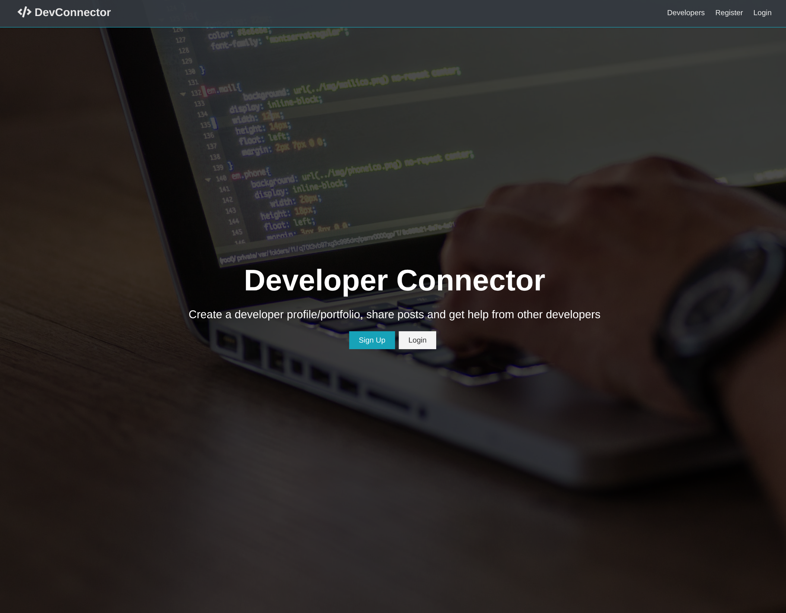
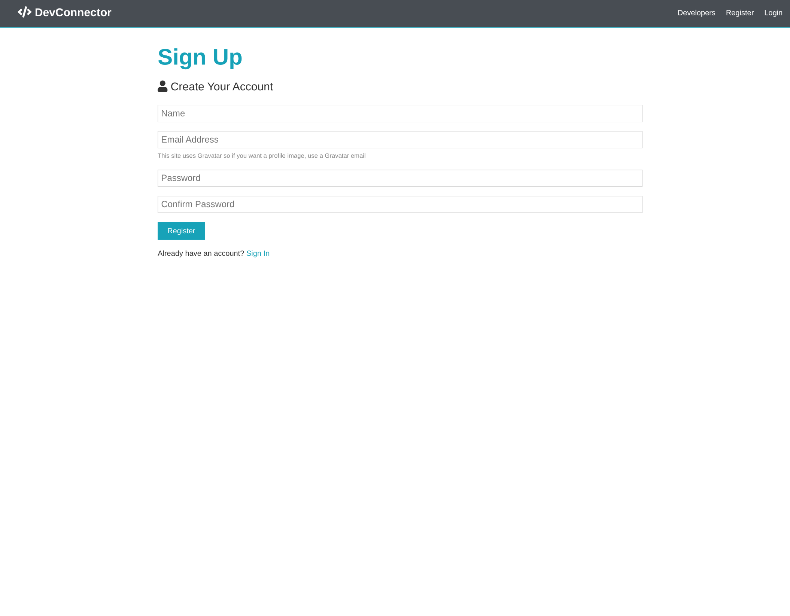
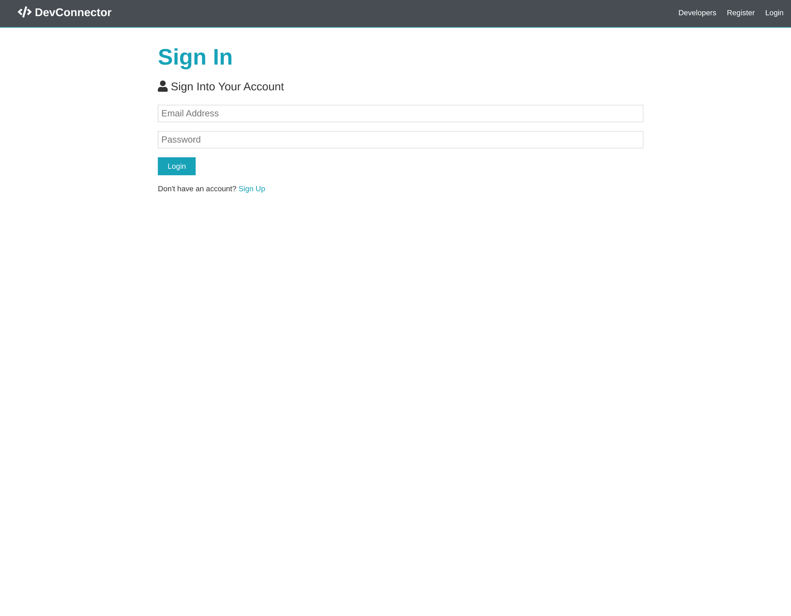
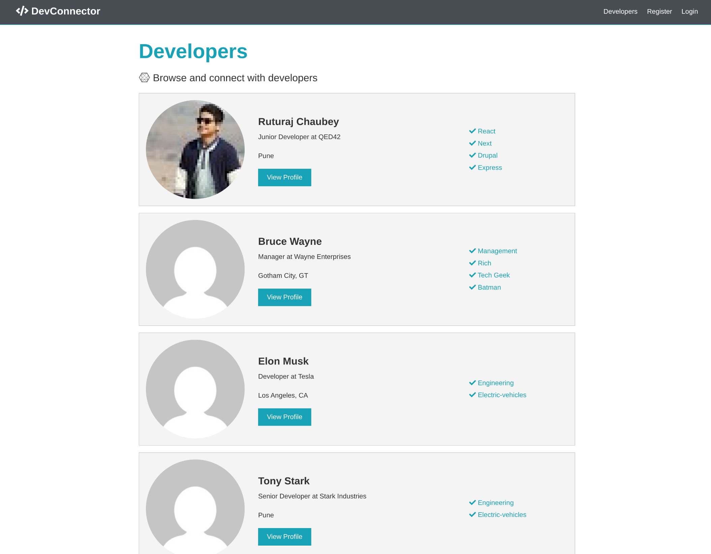
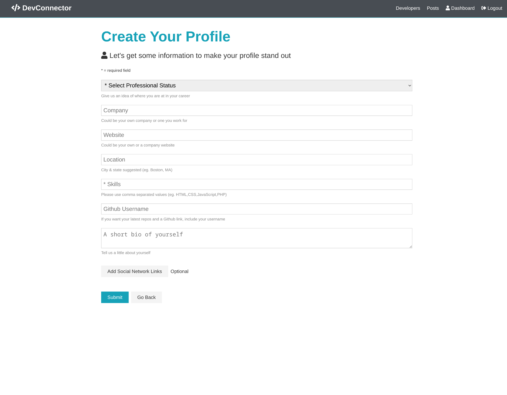
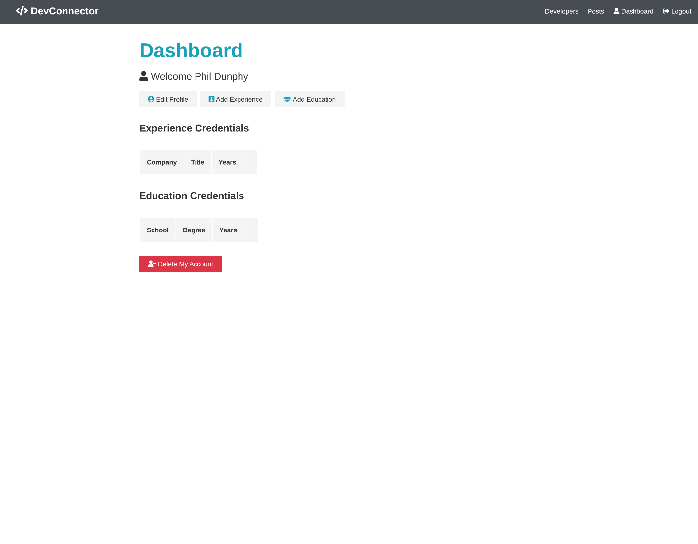
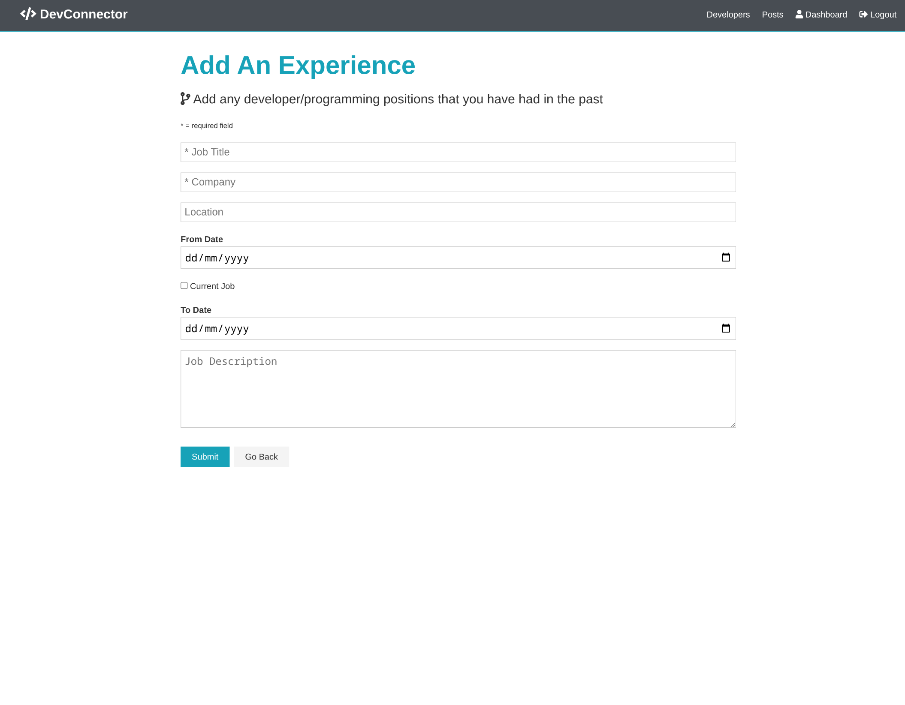
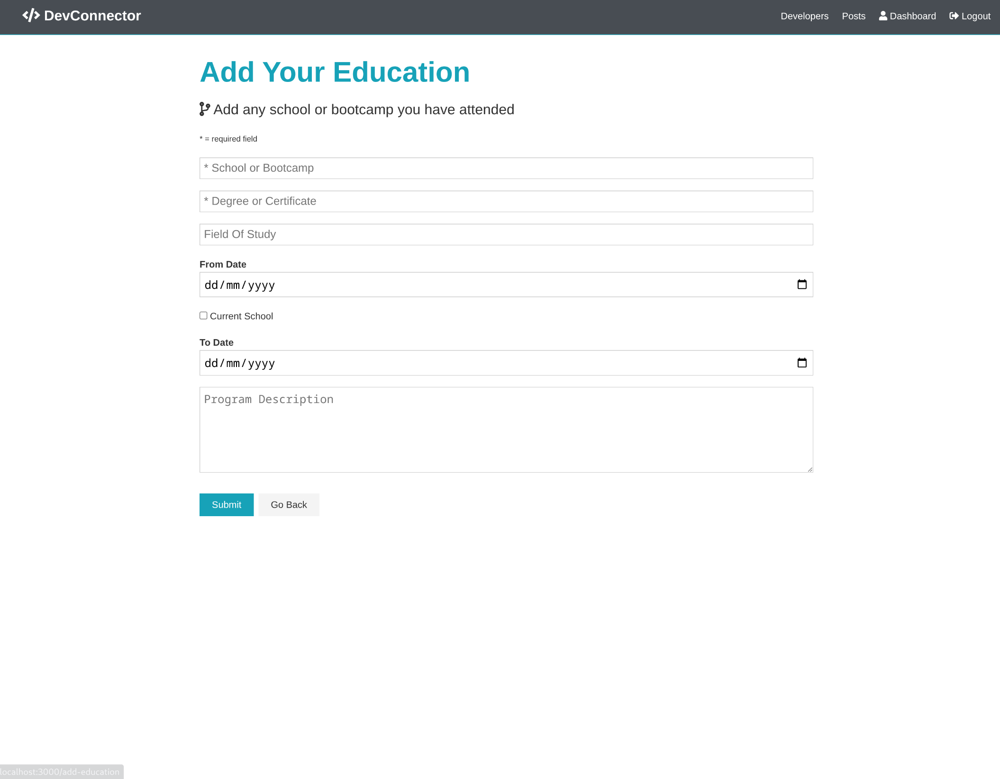
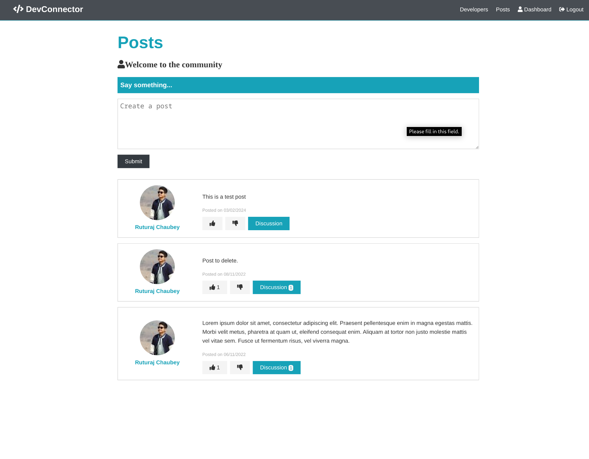
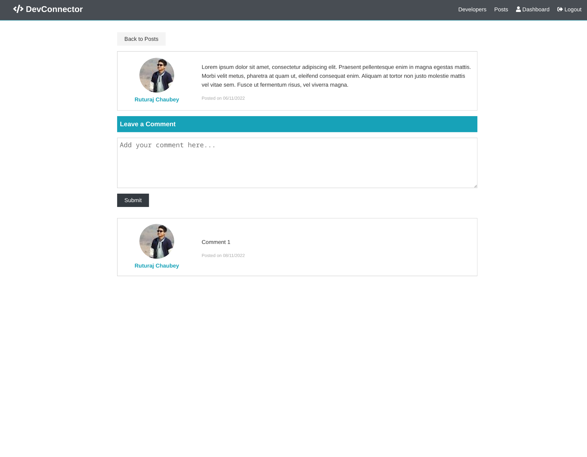

# DevConnector

A social networking platform for developers built with the MERN stack (MongoDB, Express, React, Node.js). DevConnector enables developers to create profiles, share posts, and connect with other developers.

## Features

- **User Authentication**: Complete JWT-based authentication system
- **Developer Profiles**: 
  - Create and update developer profiles
  - Add work experience and education details
  - Link GitHub repositories
  - Display latest repos
- **Posts and Interactions**:
  - Create, like, and comment on posts
  - Delete posts and comments
  - View other developers' posts
- **Real-time Alerts**: Immediate feedback for user actions
- **Protected Routes**: Secure routing system for authenticated users
- **Profile Management**:
  - Add/Delete experiences
  - Add/Delete education
  - Link social media profiles

## Screenshots

### Home Page

*Landing page of DevConnector*

### User Authentication

*User registration page with form validation*


*Secure login page for existing users*

### Developer Profiles

*Browse and connect with other developers*


*Create your developer profile with detailed information*

### Dashboard

*User dashboard showing profile information and actions*

### Experience and Education

*Add your professional experience*


*Add your educational background*

### Posts and Interactions

*Share your thoughts with the developer community*


*View and interact with posts through comments and likes*

## Tech Stack

- **Frontend**:
  - React (v18)
  - Redux for state management
  - React Router for routing
  - Axios for API requests
  - Moment.js for time formatting
  
- **Backend**:
  - Node.js
  - Express
  - MongoDB with Mongoose
  - JWT for authentication
  - bcryptjs for password hashing
  
- **Database**:
  - MongoDB Atlas

## Prerequisites

- Node.js (v14 or higher)
- MongoDB Atlas account
- npm or yarn package manager

## Installation

1. Clone the repository
```bash
git clone <repository-url>
cd DevConnector
```

2. Install server dependencies
```bash
npm install
```

3. Install client dependencies
```bash
cd client
npm install
```

4. Create a `default.json` file in the `config` folder with the following:
```json
{
    "mongoURI": "your_mongodb_uri",
    "jwtSecret": "your_jwt_secret",
    "githubClientId": "your_github_client_id",
    "githubSecret": "your_github_secret"
}
```

Note: You'll need to:
- Create a MongoDB Atlas cluster and get your MongoDB URI
- Create a random string for JWT Secret
- Register a new GitHub OAuth application at https://github.com/settings/developers to get your GitHub credentials
  - Set Homepage URL to `http://localhost:3000`
  - Set Authorization callback URL to `http://localhost:3000/login`

## Running the Application

1. Run both frontend and backend (from root directory)
```bash
npm run dev
```

Or run them separately:

2. Run backend only
```bash
npm run server
```

3. Run frontend only
```bash
npm run client
```

The application will be available at:
- Frontend: `http://localhost:3000`
- Backend API: `http://localhost:5000`

## API Endpoints

### Users & Authentication
- POST `/api/users` - Register user
- POST `/api/auth` - Authenticate user & get token
- GET `/api/auth` - Get authenticated user

### Profile Routes
- GET `/api/profile/me` - Get current user's profile
- POST `/api/profile` - Create/Update profile
- GET `/api/profile` - Get all profiles
- GET `/api/profile/user/:user_id` - Get profile by user ID
- DELETE `/api/profile` - Delete profile & user
- PUT `/api/profile/experience` - Add profile experience
- DELETE `/api/profile/experience/:exp_id` - Delete experience
- PUT `/api/profile/education` - Add profile education
- DELETE `/api/profile/education/:edu_id` - Delete education
- GET `/api/profile/github/:username` - Get user repos from GitHub

### Posts Routes
- POST `/api/posts` - Create a post
- GET `/api/posts` - Get all posts
- GET `/api/posts/:id` - Get post by ID
- DELETE `/api/posts/:id` - Delete a post
- PUT `/api/posts/like/:id` - Like a post
- PUT `/api/posts/unlike/:id` - Unlike a post
- POST `/api/posts/comment/:id` - Comment on a post
- DELETE `/api/posts/comment/:id/:comment_id` - Delete comment

## License

This project is licensed under the MIT License

## Contributing

1. Fork the repository
2. Create your feature branch (`git checkout -b feature/amazing-feature`)
3. Commit your changes (`git commit -m 'Add some amazing feature'`)
4. Push to the branch (`git push origin feature/amazing-feature`)
5. Open a Pull Request

## Acknowledgments

- Modern UI/UX principles
- RESTful API design
- Secure authentication practices
- Scalable folder structure
